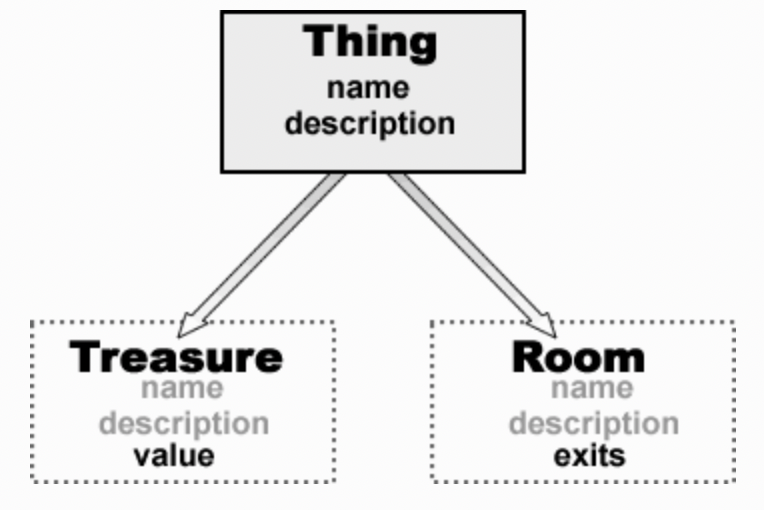

# 第二章：类的层次结构、属性与变量

## 类的层次结构、属性与变量

在上一节结束时我们创建两个类：Thing 和 Treasure，尽管事实上这两个类共享了一些功能（特别是两者都包含 ‘name’），但它们是没有联系的。

现在，这两个类的重复看起来是不值一提的。但是，当你开始写一些复杂的程序时，你的类将会包含大量的变量和方法；你真的想将同样的事情一遍又一遍的重复吗。

对于其中一个类是其它（祖先）类的特殊类型结构来说创建一个类层次是更有意义的，这种情况下它会自动继承（inherit）祖先类的特征。例如，在我们简单的冒险游戏中，Treasure 是 Thing 的一个特殊的类型，因此 Treasure 就会继承 Thing 类的特征。

**类层次——祖先（Ancestors）和后代（Descendants）**：在这本书中，我会经常提及“后代”类继承（inherit）自它们祖先类，这些术语意味着“相关”类之间的一种类似于家庭的关系。Ruby 中每一个类只有一个父亲，然而，它可能在一个很长很大的家庭树中，有许多代的父母、祖父母等等…
Thing 类的特征通常被定义在它内部，Treasure 类则会自动地“继承” Thing 类所有的的特性。所以，我们不需要再次对这些特征进行编码，而是额外添加一些 Treasures 类特有的特性。

通常地规则是，在创建类层次结构时，具有更多通用特征的类要比具有更多特殊特征的类层次更高一些。所以，只有一个 name 和 description 的 Thing 类是具有 name、description 以及 value 的 Treasure 类的祖先；Thing 类也可能是一些其它的特殊类的祖先，例如具有 name、description 以及 exits 的 Room 类。

一个父亲，有多个孩子…



Thing 类具有 name 和 description （在 Ruby 程序中，它们可能是内部变量 `@name` 和 `@description`）。Treasure 和 Room 类都派生自 Thing 类，所以它们自动地继承了 name 和 description 。Treasure 类添加了一个 value，所以它就具有 name、description 和 value ；

Room 类添加了一个 exits，所以它就具有 name、description 和 exits 。

1adventure.rb

来让我们看看如何在 Ruby 中创建一个后代类。加载 1adventure.rb 程序，这只需要定义一个具有两个实例变量（instance variables）`@name` 和 `@description` 的 Thing 类，它们的值可以在创建新的 Thing 对象时在 `initialize` 方法中赋值。

实例变量通常不能（也不应该）被外部直接访问，这是为了遵循上一章讲到的封装（ encapsulation）原则。为了获得我们所需要的每个变量的值，我们需要一个 get 访问器方法，例如 `get_name`；为了给某个变量赋一个新值，我们也需要一个 set 访问器方法，例如 `set_name`。

超类与子类

现在来看看 Treasure 类，注意声明方式：

```ruby
class Treasure < Thing
```

尖括号 < 表示 Treasure 是 Thing 的一个子类（后代类），因此它从 Thing 类继承数据（变量）和行为（方法）。因为 `get_name`、`set_name`、`get_description` 以及 `set_description` 方法已经存在于 Thing 类中，所以不需要在后代类（Treasure）中再编写了。

Treasure 类还有额外的数据，也就是它的 value（`@value`），我已经为它编写了 get 和 set 访问器了。当创建一个新的 Treasure 对象时，它的 `initialize` 方法会被自动调用。一个 Treasure 对象有三个变量（`@name`、`@description` 和 `@value`）需要初始化，所以它的 `initialize` 方法有三个参数。前两个参数使用 `super` 关键字传递给超类（Thing）的 `initialize` 方法，以便 Thing 类的 `initialize` 方法可以处理它们：

```ruby
super(aName, aDescription)
```

当在方法中使用时，`super` 关键字调用在祖先类或超类中的与当前所在方法的同名方法。如果 `super` 关键字没有指定任何参数，当前方法的所有参数将会传递给祖先类的方法。但是，像本例中一样，提供了一个特定的参数列表时（这里是 `aName` 和 `aDescription`），那么只有这些参数会被传递给祖先类的方法。

## 向超类传递参数

当调用超类的方法时，括号是很重要的！如果参数列表为空，并且没有使用括号，那么所有的参数都将传递给超类。但是，参数列表为空，并且使用了括号时，将不会给超类传递任何参数。

super_args.rb

```ruby
# This passes a, b, c to the superclass
def initialize(a, b, c, d, e, f)
  super(a, b, c)
end
# This passes a, b, c to the superclass
def initialize(a, b, c)
  super
end
# This passes no arguments to the superclass
def initialize(a, b, c)
  super()
```
  
要更好的了解 `super` 关键字的使用，请参阅本章末尾的深入探索部分。

## 访问器方法

虽然这些类在冒险游戏中运行的足够好，但它们仍然是累赘的，因为设置了大量的 get 和 set 访问器方法。让我们看看有什么补救措施。

替换掉 `@description` 实例变量的两个不同的方法，`get_description` 和 `set_description`。

```ruby
puts(t1.get_description)
t1.set_description("Some description")
```

取值和赋值也许更好一些，对于一个简单的变量使用下面的方式进行取值和赋值：

```ruby
puts(t1.description)
t1.description = "Some description"
```

为了能够做到这一点，我们需要修改 Treasure 类的定义。实现这一点的方法是重写 `@description` 的访问器方法：

```ruby
def description
  return @description
end
def description=(aDescription)
  @description = aDescription
end
```

accessors1.rb

我已经在 accessors1.rb 中添加了类似于上面的访问器。get 访问器被称为 `description`，set 访问器被称为 `description=`（即就是，将等号（=）附加到 get 访问器方法名后面）。现在，就可以将一个新的字符串进行赋值了：

```ruby
t.description = "a bit faded and worn around the edges"
```

你可以像这样取值：

```ruby
puts(t.description)
```

## “Set’ 访问器

当你想要以这种方式编写 set 访问器时，必须将 = 字符附加到方法名后面，而不仅仅是将其放置于方法名和参数之间。

所以，这样是正确的：

```ruby
def name=(aName)
```

但这样是错误的：

```ruby
def name = (aName)”
```

