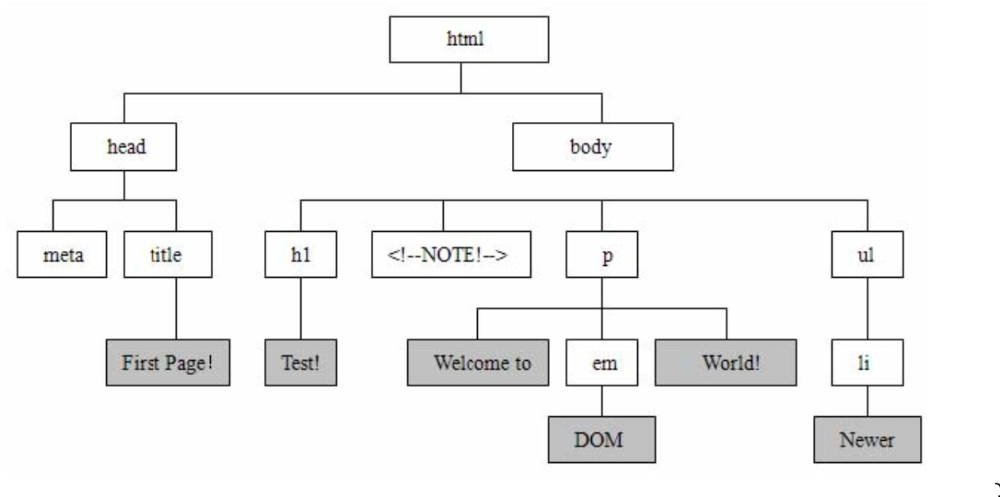

# 基础DOM和CSS操作

DOM 在 JavaScript 课程中我们详细的探讨过，它是一种文档对象模型。方便开发者对 HTML 结构元素内容进行展示和修改。在 JavaScript 中，DOM 不但内容庞大繁杂，而且我 们开发的过程中需要考虑更多的兼容性、扩展性。在 jQuery 中，已经将最常用的 DOM 操 作方法进行了有效封装，并且不需要考虑浏览器的兼容性。

## 一.DOM 简介

由于课程是基于 JavaScript 基础上完成的，这里我们不去详细的了解 DOM 到底是什么。只需要知道几个基本概念:

1. D 表示的是页面文档 Document、O 表示对象，即一组含有独立特性的数据集合、M表示模型，即页面上的元素节点和文本节点。
2. DOM 有三种形式，标准 DOM、HTML DOM、CSS DOM，大部分都进行了一系列的封装，在 jQuery 中并不需要深刻理解它。
3. 树形结构用来表示 DOM，就非常的贴切，大部分操作都是元素节点操作，还有少部分是文本节点操作。



## 二.设置元素及内容

我们通过前面所学习的各种选择器、过滤器来得到我们想要操作的元素。这个时候，我 们就可以对这些元素进行 DOM 的操作。那么，最常用的操作就是对元素内容的获取和修改。

**width()方法**

| 方法名 | 描述 |
| -- | -- |
| `width()` | 获取某个元素的长度 |
| `width(value)` | 设置某个元素的长度 |
| `width(function (index, width) {})` | 通过匿名函数设置某个元素的长度 |

```javascript
$('div').width();//获取元素的长度，返回的类型为number
$('div').width(500); //设置元素长度，直接传数值，默认加 px
$('div').width('500pt'); //同上，设置了 pt 单位
$('div').width(function (index, value) {//index 是索引，value 是原本值
  return value - 500;//无须调整类型，直接计算
});
```

**height()方法**

| 方法名 | 描述 |
| -- | -- |
| height() | 获取某个元素的长度 |
| height(value) | 设置某个元素的长度 |
| height(function (index, width) {}) | 通过匿名函数设置某个元素的长度 |

```javascript
$('div').height(); //获取元素的高度，返回的类型为number
$('div').height(500); //设置元素高度，直接传数值，默认加 px
$('div').height('500pt'); //同上，设置了 pt 单位
$('div').height(function (index, value) { //index 是索引，value 是原本值 //无须调整类型，直接计算
  return value - 1;
});
```

**内外边距和边框尺寸方法**

| 方法名 | 描述 |
| -- | -- |
| `innerWidth()` | 获取元素宽度，包含内边距 padding |
| `innerHeight()` | 获取元素高度，包含内边距 padding |
| `outerWidth()` | 获取元素宽度，包含边框 border 和内边距 padding |
| `outerHeight()` | 获取元素高度，包含边框 border 和内边距 padding |
| `outerWidth(ture)` | 同上，且包含外边距 |
| `outerHeight(true)` | 同上，且包含外边距 |

```javascript
alert($('div').width()); //不包含
alert($('div').innerWidth()); //包含内边距 padding
alert($('div').outerWidth()); //包含内边距 padding+边框 border
alert($('div').outerWidth(true));//包含内边距 padding+边框 border+外边距 margin
```

**元素偏移方法**

| 方法名 | 描述 |
| -- | -- |
| `offset()` | 获取某个元素相对于视口的偏移位置 |
| `position()` | 获取某个元素相对于父元素的偏移位置 |
| `scrollTop()` | 获取垂直滚动条的值 |
| `scrollTop(value)` | 设置垂直滚动条的值 |
| `scrollLeft()` | 获取水平滚动条的值 |
| `scrollLeft(value)` | 设置水平滚动条的值 |

```javascript
$('strong').offset().left; //相对于视口的偏移
$('strong').position().left; //相对于父元素的偏移
$(window).scrollTop(); //获取当前滚动条的位置
$(window).scrollTop(300); //设置当前滚动条的位置
```


