# Node.js简介
 
## Node.js的定义:

> Node.js是一个基于V8 JavaScript引擎的JavaScript运行时环境。
   
## 浏览器内核是什么?

不同的浏览器有不同的内核组成，常见浏览器内核：

1. Gecko:早期被Netscape和Mozilla Firefox浏览器使用;
2. Trident:微软开发，被IE4~IE11浏览器使用，但是Edge浏览器已经转向Blink;
3. Webkit:苹果基于KHTML开发、开源的，用于Safari，Google Chrome之前也在使用;
4. Blink:是Webkit的一个分支，Google开发，目前应用于Google Chrome、Edge、Opera等; 

## 排版引擎

事实上，我们经常说的浏览器内核指的是浏览器的排版引擎:

> **排版引擎**(layout engine)，也称为**浏览器引擎**(browser engine)、**页面渲染引擎**(rendering engine) 或**样版引擎**。

排版引擎工作流程：

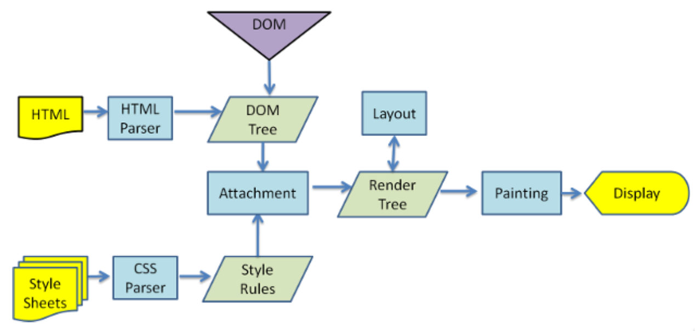

在这个执行过程中，HTML解析的时候遇到了JavaScript标签，应该怎么办呢? 会停止解析HTML，而去加载和执行JavaScript代码。为什么不异步去加载执行JavaScript代码，而要在这里停止掉呢?这是因为JavaScript代码可以操作我们的DOM;所以浏览器希望将HTML解析的DOM和JavaScript操作之后的DOM放到一起来生成最终的DOM树，而不是频繁的去生成新的DOM树。那么，JavaScript代码由谁来执行呢——**JavaScript引擎**。

## JavaScript引擎

**为什么需要JavaScript引擎呢?**

* 事实上我们编写的JavaScript无论你交给浏览器或者Node执行，最后都是需要被CPU执行的; 
* 但是CPU只认识自己的指令集，实际上是机器语言，才能被CPU所执行;
* 所以我们需要JavaScript引擎帮助我们将JavaScript代码翻译成CPU指令来执行;

**比较常见的JavaScript引擎有哪些呢?**

* **SpiderMonkey**:第一款JavaScript引擎，由Brendan Eich开发(也就是JavaScript作者); 
* **Chakra**:微软开发，用于IT浏览器;
* **JavaScriptCore**:WebKit中的JavaScript引擎，Apple公司开发;
* **V8**:Google开发的强大JavaScript引擎，也帮助Chrome从众多浏览器中脱颖而出;
 
## WebKit内核

WebKit事实上由两部分组成的:

* WebCore:负责HTML解析、布局、渲染等等相关的工作; 
* JavaScriptCore:解析、执行JavaScript代码;

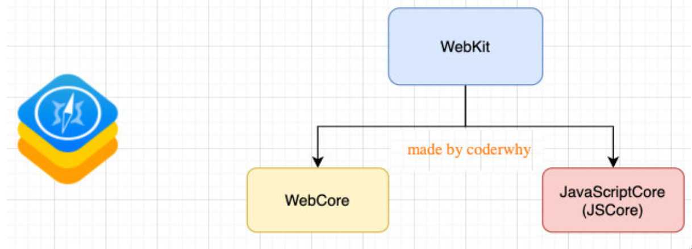
 
## V8引擎

### V8引擎的官方定义:

* V8是用C++编写的Google开源高性能JavaScript和WebAssembly引擎，它用于Chrome和Node.js等。
* 它实现ECMAScript和WebAssembly，并在Windows 7或更高版本，macOS 10.12+和使用x64，IA-32， ARM或MIPS处理器的Linux系统上运行。
* V8可以独立运行，也可以嵌入到任何C ++应用程序中。
    
### V8引擎的原理

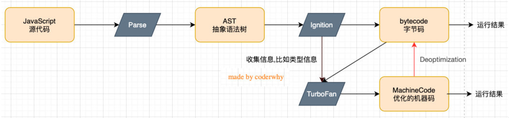

**1 Parse模块会将JavaScript代码转换成AST(抽象语法树)，这是因为解释器并不直接认识JavaScript代码;**

* 如果函数没有被调用，那么是不会被转换成AST的;
* [Parse的V8官方文档](https://v8.dev/blog/scanner)

**2 Ignition是一个解释器，会将AST转换成ByteCode(字节码)**

* 同时会收集TurboFan优化所需要的信息(比如函数参数的类型信息，有了类型才能进行真实的运算);
* 如果函数只调用一次，Ignition会执行解释执行ByteCode;
* [Ignition的V8官方文档](https://v8.dev/blog/ignition-interpreter)

**3 TurboFan是一个编译器，可以将字节码编译为CPU可以直接执行的机器码**

* 如果一个函数被多次调用，那么就会被标记为热点函数，那么就会经过TurboFan转换成优化的机器码，提高代码的执行性能;
* 但是，机器码实际上也会被还原为ByteCode，这是因为如果后续执行函数的过程中，类型发生了变化(比如sum函数原来执行的是number类型，后 来执行变成了string类型)，之前优化的机器码并不能正确的处理运算，就会逆向的转换成字节码;
* [TurboFan的V8官方文档](https://v8.dev/blog/turbofan-jit)

#### Orinoco模块内存回收: 

* Orinoco模块，负责垃圾回收，将程序中不需要的内存回收;
* [Orinoco的V8官方文档](https://v8.dev/blog/trash-talk)
     
## 回顾Node.js是什么

> Node.js是一个基于V8 JavaScript引擎的JavaScript运行时环境。

也就是说Node.js基于V8引擎来执行JavaScript的代码，但是不仅仅只有V8引擎:

* 前面我们知道V8可以嵌入到任何C++应用程序中，无论是Chrome还是Node.js，事实上都是嵌入了V8引擎来执行JavaScript代码;
* 但是在Chrome浏览器中，还需要解析、渲染HTML、CSS等相关渲染引擎，另外还需要提供支持浏览器操作的API、浏览器自己的事件循环等;
* 另外，在Node.js中我们也需要进行一些额外的操作，比如文件系统读/写、网络IO、加密、压缩解压文件等操作;

## 浏览器和Node.js架构区别

我们可以简单理解规划出Node.js和浏览器的差异:

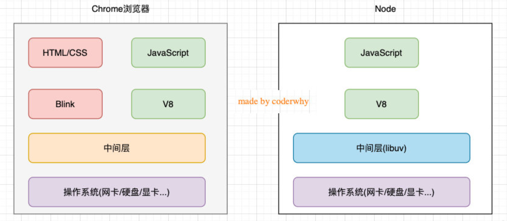

## Node.js架构

我们来看一个单独的Node.js的架构图:

* 我们编写的JavaScript代码会经过V8引擎，再通过Node.js的Bindings，将任务放到Libuv的事件循环中; 
* **libuv**(Unicorn Velociraptor—独角伶盗龙)是使用C语言编写的库;
* libuv提供了事件循环、文件系统读写、网络IO、线程池等等内容;
* 具体内部代码的执行流程，我会在后续专门讲解事件和异步IO的原理中详细讲解;

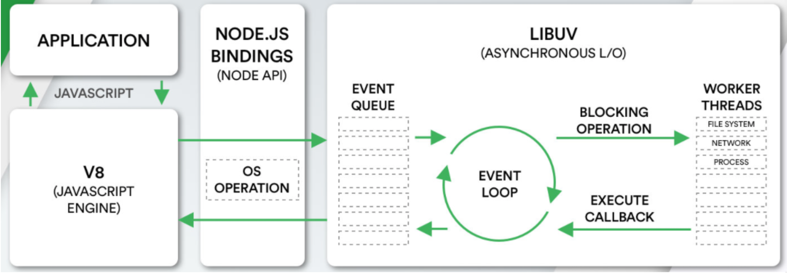
  
## Node的安装

* LTS版本:相对稳定一些，推荐线上环境使用该版本;
* Current版本:最新的Node版本，包含很多新特性;

Node的安装方式有很多:

* 可以借助于一些操作系统上的软件管理工具，比如Mac上的homebrew，Linux上的yum、dnf等; 
* 也可以直接下载对应的安装包下载安装;

我们选择下载安装，下载自己操作系统的安装包直接安装就可以了:

* window选择.msi安装包，Mac选择.pkg安装包，Linux会在后续部署中讲解;
* 安装过程中会配置环境变量(让我们可以在命令行使用);
* 并且会安装npm(Node Package Manager)工具;
 
## Node的版本工具

在实际开发学习中，我们只需要使用一个Node版本来开发或者学习即可。但是，如果你希望通过可以快速更新或切换多个版本时，可以借助于一些工具（这两个工具都不支持window）:

* nvm:Node Version Manager;
* n:Interactively Manage Your Node.js Versions(交互式管理你的Node.js版本)
 
## 版本管理工具:n

安装n:直接使用npm安装即可

```shell
# 安装工具n
npm install -g n
# 查看安装的版本
n --version
```

#### 安装最新的lts版本:

* 前面添加的sudo是权限问题;
* 可以两个版本都安装，之后我们可以通过n快速在两个版本间切换;

```shell
# 安装最新的lts版本
n lts

# 安装最新的版本
n latest

# 查看所有的版本
n
```

## JavaScript代码执行

如果我们编写一个js文件，里面存放JavaScript代码，如何来执行它呢?目前我们知道有两种方式可以执行: 

* 将代码交给浏览器执行;
* 将代码载入到node环境中执行;

把代码交给浏览器执行:

* 需要通过让浏览器加载、解析html代码，所以我们需要创建一个html文件; 
* 在html中通过script标签，引入js文件;
* 当浏览器遇到script标签时，就会根据src加载、执行JavaScript代码;

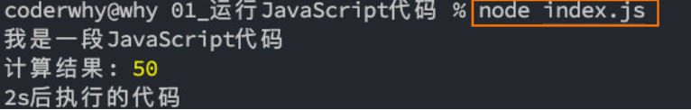

把js文件交给node执行:

* 首先电脑上需要安装Node.js环境，安装过程中会自动配置环境变量; 
* 可以通过终端命令node js文件的方式来载入和执行对应的js文件;

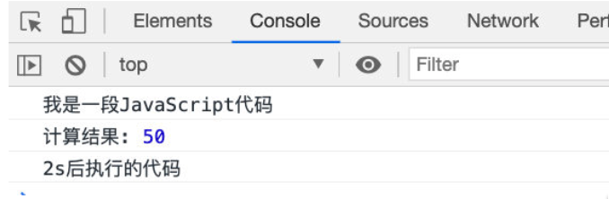
 
## Node的REPL

* REPL是Read-Eval-Print Loop的简称，翻译为“读取-求值-输出”循环; 
* REPL是一个简单的、交互式的编程环境;

事实上，我们浏览器的console就可以看成一个REPL。

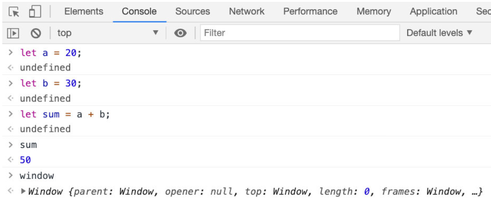

Node也给我们提供了一个REPL环境，我们可以在其中演练简单的代码。

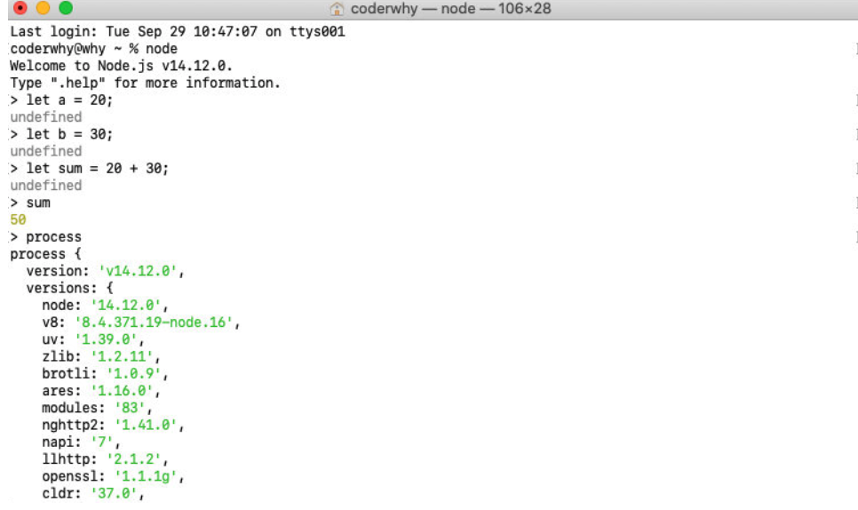

## Node程序传递参数

正常情况下执行一个node程序，直接跟上我们对应的文件即可: 

```
node index.js
```

但是，在某些情况下执行node程序的过程中，我们可能希望给node传递一些参数: 

```
node index.js env=development coderwhy
```

如果我们这样来使用程序，就意味着我们需要在程序中获取到传递的参数:

* 获取参数其实是在process的内置对象中的;
* 如果我们直接打印这个内置对象，它里面包含特别的信息:
* 其他的一些信息，比如版本、操作系统等大家可以自行查看，后面用到一些其他的我们还会提到;

现在，我们先找到其中的argv属性:

* 我们发现它是一个数组，里面包含了我们需要的参数;

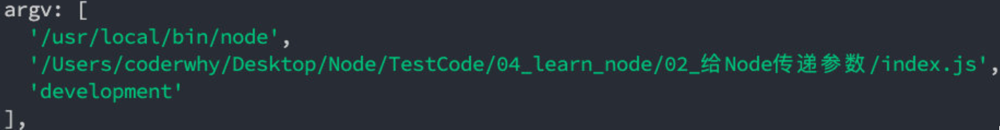

## 为什么叫argv呢?

为什么叫argv呢?在C/C++程序中的main函数中，实际上可以获取到两个参数: 

* argc:argument counter的缩写，传递参数的个数;
* argv:argument vector的缩写，传入的具体参数。

> * vector翻译过来是矢量的意思，在程序中表示的是一种数据结构。 
> * 在C++、Java中都有这种数据结构，是一种数组结构;
> * 在JavaScript中也是一个数组，里面存储一些参数信息;

我们可以在代码中，将这些参数信息遍历出来，使用:

```javascript
// 获取参数
console.log(process.argv);
process.argv.forEach(item => {
  conlose.log(item);
});
```
  
## Node的输出

* 最常用的输入内容的方式: `console.log`
* 清空控制台: `console.clear`
* 打印函数的调用栈: `console.trace`

其他console方法:[https://nodejs.org/dist/latest-v14.x/docs/api/console.html](https://nodejs.org/dist/latest-v14.x/docs/api/console.html)
  
## 常见的全局对象

* __dirname
* __filename
* clearImmediate(immediateObject)
* clearInterval(intervalObject)
* clearTimeout(timeoutObject)
* console
* exports
* global
* module
* process
* queueMicrotask(callback)
* require()
* setImmediate(callback[, ...args])
* setInterval(callback, delay[, ...args])
* setTimeout(callback, delay[, ...args])
* TextDecoder
* TextEncoder
* URL
* URLSearchParams
* WebAssembly

#### __dirname:获取当前文件所在的路径: 

* 注意:不包括后面的文件名

```javascript
console.log(__dirname);
// /Users/aaron/Library/Test
```

#### __filename:获取当前文件所在的路径和文件名称: 

* 注意:包括后面的文件名称

```javascript
console.log(__filename);
// /Users/aaron/Library/Test/test.js
```

#### process对象:process提供了Node进程中相关的信息:

* 比如Node的运行环境、参数信息等;
* 后面在项目中，我也会讲解，如何将一些环境变量读取到 process 的 env 中;

#### console对象:提供了简单的调试控制台，在前面讲解输入内容时已经学习过了。 

* 更加详细的查看官网文档:https://nodejs.org/api/console.html

#### 定时器函数:在Node中使用定时器有好几种方式:

* `setTimeout(callback, delay[, ...args])`: callback在delay毫秒后执行一次;
* `setInterval(callback, delay[, ...args])`: callback每delay毫秒重复执行一次;
* `setImmediate(callback[, ...args])`: callback I / O事件后的回调的“立即”执行;

> * 这里先不展开讨论它和`setTimeout(callback, 0)`之间的区别;
> * 因为它涉及到事件循环的阶段问题，我会在后续详细讲解事件循环相关的知识; 

* `process.nextTick(callback[, ...args])`:添加到下一次tick队列中;
 
> * 具体的讲解，也放到事件循环中说明;
 
## global对象

global是一个全局对象，事实上前端我们提到的process、console、setTimeout等都有被放到global中:

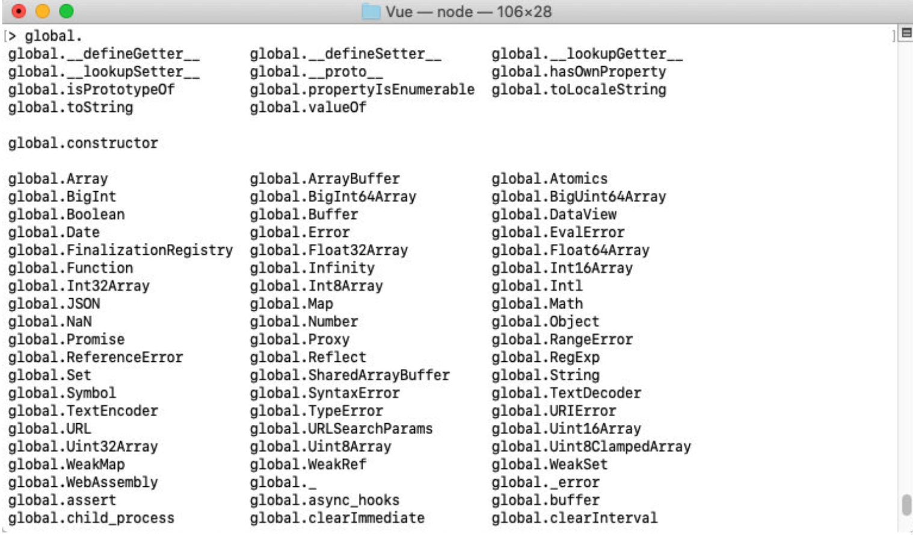
  
## global和window的区别

在浏览器中，全局变量都是在`window`上的，比如有document、setInterval、setTimeout、alert、console等等。在Node中，我们也有一个`global`属性，并且看起来它里面有很多其他对象。

但是在浏览器中执行的JavaScript代码，如果我们在顶级范围内通过var定义的一个属性，默认会被添加到`window`对象上:

```javascript
var name = 'hello world';
console.log(window.name); // hello world
```

但是在node中，我们通过var定义一个变量，它只是在当前模块中有一个变量，不会放到全局中:

```javascript
var name = 'hello world';
console.log(global.name); // undefined
```
   