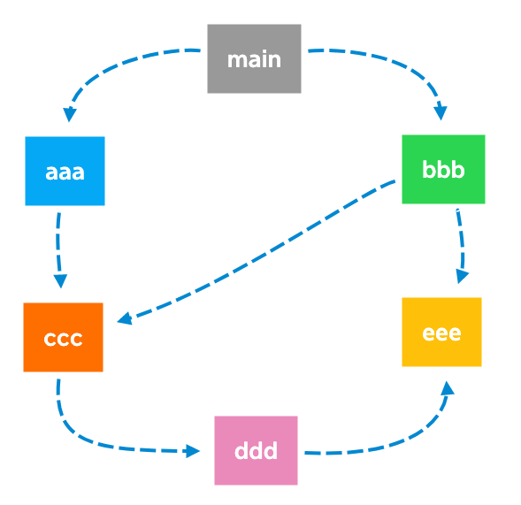

#  JavaScript模块化

## 什么是模块化呢?

事实上模块化开发最终的目的是将程序划分成**一个个小的结构**;这个结构中编写属于**自己的逻辑代码**，有**自己的作用域**，不会影响到其他的结构; 这个结构可以将自己希望暴露的**变量、函数、对象等导出**给其结构使用;也可以通过某种方式，**导入另外结构中的变量、函数、对象**等;

上面说提到的结构，就是模块;按照这种结构划分开发程序的过程，就是模块化开发的过程;

无论你多么喜欢JavaScript，以及它现在发展的有多好，我们都需要承认在Brendan Eich用了10天写出JavaScript的时候，它都有很多的缺陷:比如var定义的变量作用域问题;比如JavaScript的面向对象并不能像常规面向对象语言一样使用class;比如JavaScript没有模块化的问题;Brendan Eich本人也多次承认过JavaScript设计之初的缺陷，但是随着JavaScript的发展以及标准化，存在的缺陷问题基 本都得到了完善。无论是web、移动端、小程序端、服务器端、桌面应用都被广泛的使用;

## 早期的JavaScript

在网页开发的早期，Brendan Eich开发JavaScript仅仅作为一种脚本语言，做一些简单的表单验证或动画实现等，那个时 候代码还是很少的:

* 这个时候我们只需要讲JavaScript代码写到`<script>`标签中即可;
* 并没有必要放到多个文件中来编写;甚至流行:通常来说 JavaScript 程序的**长度只有一行**。

但是随着前端和JavaScript的快速发展，JavaScript代码变得越来越复杂了:

* ajax的出现，**前后端开发分离**，意味着后端返回数据后，我们需要通过**JavaScript进行前端页面的渲染**;
* SPA的出现，前端页面变得更加复杂:包括**前端路由、状态管理**等等一系列复杂的需求需要通过JavaScript来实现; 
* 包括Node的实现，JavaScript编写**复杂的后端程序**，没有模块化是致命的硬伤;

所以，模块化已经是JavaScript一个非常迫切的需求:

* 但是JavaScript本身，直到**ES6**(2015)才推出了自己的模块化方案;
* 在此之前，为了让JavaScript支持模块化，涌现出了很多不同的模块化规范:**AMD**、**CMD**、**CommonJS**等;
 
## 没有模块化带来的问题

**命名冲突的问题**

```javascript
// aaa.js文件中，小明定义了一个变量，名称是flag，并且为true
flag = true

// bbb.js文件中，小丽也喜欢用flag这个变量名称，只是为false
flag = false

// main.js文件中，小明想通过flag进行一些判断，完成后续的事情
if (flag) {
   console.log('小明是个天才');
}
```

**解决办法:立即函数调用表达式IIFE(Immediately Invoked Function Expression)**

```javascript
// bar.js文件
var moduleBar = (function () {
  var name = "小明";
  var age = 18;

  console.log(name);

  return {
    name,
    age
  }
})()

// baz.js中调用
console.log(moduleBar.name);
console.log(moduleBar.age);
```

**IIFE缺点:**

* 第一，必须记得每一个模块中返回对象的命名，才能在其他模块使用过程中正确的使用;
* 第二，代码写起来混乱不堪，每个文件中的代码都需要包裹在一个匿名函数中来编写;
* 第三，在没有合适的规范情况下，每个人、每个公司都可能会任意命名、甚至出现模块名称相同的情况;
  
## CommonJS和Node

我们需要知道CommonJS是一个规范，最初提出来是在浏览器以外的地方使用，并且当时被命名为ServerJS，后来为了 体现它的广泛性，修改为CommonJS，平时我们也会简称为CJS。

* Node是CommonJS在服务器端一个具有代表性的实现; 
* Browserify是CommonJS在浏览器中的一种实现;
* webpack打包工具具备对CommonJS的支持和转换;

所以，Node中对CommonJS进行了支持和实现，让我们在开发node的过程中可以方便的进行模块化开发:

* 在Node中每一个js文件都是一个单独的模块;
* 这个模块中包括CommonJS规范的核心变量:exports、module.exports、require;
* 我们可以使用这些变量来方便的进行模块化开发;

前面我们提到过模块化的核心是导出和导入，Node中对其进行了实现:

* `exports`和`module.exports`可以负责对模块中的内容进行导出;
* `require`函数可以帮助我们导入其他模块(自定义模块、系统模块、第三方库模块)中的内容;

## 案例设定

我们来看一下两个文件:

**mian.js**

```javascript
console.log(name);
console.log(age);

sayHello('kobe');
```

**bar.js**

```javascript
const name = 'coderwhy';
const age = 18;

function sayHello(name) {
   console.log("Hello" + name);
}
```

## exports导出/require导入

**注意:exports是一个对象，我们可以在这个对象中添加很多个属性，添加的属性会导出**

```javascript
exports.name = name;
exports.age = age;
exports.sayHello = sayHello;
```

**另外一个文件中可以导入:**

```javascript
const bar = require('./bar');
```

## Node.js导入/导出的本质

* 意味着main中的bar变量等于exports对象;
* 也就是require通过各种查找方式，最终找到了exports这个对象;
* 并且将这个exports对象赋值给了bar变量;
* bar变量就是exports对象了;

**main.js**

```javascript
const bar = require('./bar')

const name = bar.name;
const age = bar.age;
const sayHello = bar.sayHello;

console.log(name);
console.log(age);

setTimeout(() => {
   console.log(bar.name);
}, 2000);
```

**bar.js**

```javascript
const name = 'zhangsan';
const age = 18;

function sayHello(name) {
   console.log("Hello " + name)
}

exports.name = name;
exports.age = age;
exports.sayHello = sayHello;

setTimeout(() => {
   exports.name = 'lilei';
}, 1000);
```

结果：

```
zhangsan
18
lilei
```

exports对象中的属性修改，main中bar对象也会被修改。所以，bar对象是exports对象的引用赋值。 

## module.exports

**bar.js**

```javascript
const name = 'zhangsan';
const age = 18;

function sayHello(name) {
   console.log("Hello " + name)
}

module.exports.name = name;
module.exports.age = age;
module.exports.sayHello = sayHello;
```

module.exports和exports有什么关系或者区别呢?我们追根溯源，通过维基百科中对CommonJS规范的解析:

* CommonJS中是没有module.exports的概念的;
* 但是为了实现模块的导出，Node中使用的是Module的类，每一个模块都是Module的一个实例，也就是 module;
* 所以在Node中真正用于导出的其实根本不是exports，而是module.exports; 
* 因为module才是导出的真正实现者;

但是，为什么exports也可以导出呢?

* 这是因为module对象的exports属性是exports对象的一个引用; 
* 也就是说 module.exports = exports = main中的bar;
 
## require的查找规则

require是一个函数，可以引入一个文件(模块)中导出的变量、函数或对象。 那么，require的查找规则是怎么样的呢?

* https://nodejs.org/dist/latest-v14.x/docs/api/modules.html#modules_all_together

这里我总结比较常见的查找规则。导入格式如下:`require(X)`

**情况一:X是一个核心模块，比如path、http**

* 直接返回核心模块，并且停止查找

**情况二: X是以 ./ 或 ../ 或 /(根目录)开头的**

第一步:将X当做一个文件在对应的目录下查找;

1. 如果有后缀名，按照后缀名的格式查找对应的文件 
2. 如果没有后缀名，会按照如下顺序:

> 1. 直接查找文件X
> 2. 查找X.js文件
> 3. 查找X.json文件 
> 4. 查找X.node文件

第二步:没有找到对应的文件，将X作为一个目录，查找目录下面的index文件

> 1. 查找X/index.js文件
> 2. 查找X/index.json文件
> 3. 查找X/index.node文件

如果没有找到，那么报错:not found

**情况三:直接是一个X(没有路径)，并且X不是一个核心模块**

```javascript
console.log(module.paths)
```

打印结果为以node_modules结尾的一系列路径的数组。会在这写路径中寻找X文件，如果没有找到，那么报错:not found

## 模块的加载过程

**结论一: 模块在被第一次引入时，模块中的js代码会被运行一次**

**结论二: 模块被多次引入时，会缓存，最终只加载(运行)一次** 

为什么只会加载运行一次呢?这是因为每个模块对象module都有一个属性:loaded。为false表示还没有加载，为true表示已经加载;

**结论三:如果有循环引入，那么加载顺序是什么?**

aaa.js

```javascript
console.log('aaa');
require('./ccc');
```

bbb.js

```javascript
console.log('bbb');

require('./ccc');
require('./eee');
```

ccc.js

```javascript
console.log('ccc');

require('./ddd');
```

ddd.js

```javascript
console.log('ddd');

require('./eee');
```

eee.js

```javascript
console.log('eee');
```

main.js

```javascript
console.log("main")

require('./aaa');
require('./bbb');
```



* 如上图，这个其实是一种数据结构:图结构;
* 图结构在遍历的过程中，有深度优先搜索(DFS, depth first search)和广度优先搜索(BFS, breadth first search);
* Node采用的是深度优先算法:main -> aaa -> ccc -> ddd -> eee ->bbb
   
## CommonJS规范缺点

CommonJS加载模块是同步的，同步的意味着只有等到对应的模块加载完毕，当前模块中的内容才能被运行。服务器加载的js文件都是本地文件，加载速度非常快;而在浏览器端需要远程下载，所以在浏览器中，我们通常不使用CommonJS规范。

当然在webpack中使用CommonJS是另外一回事，因为它会将我们的代码转成浏览器可以直接执行的代码。
      
## ES Module

JavaScript没有模块化一直是它的痛点，所以才会产生我们前面学习的社区规范:CommonJS、AMD、CMD等， 所以在ES推出自己的模块化系统时，大家也是兴奋异常。

ES Module和CommonJS的模块化有一些不同之处:

* 一方面它使用了import和export关键字;
* 另一方面它采用编译期的静态分析，并且也加入了动态引用的方式;
nES Module模块采用export和import关键字来实现模块化: 
* export负责将模块内的内容导出;
* import负责从其他模块导入内容;
n了解:采用ES Module将自动采用[严格模式use strict](https://developer.mozilla.org/zh-CN/docs/Web/JavaScript/Reference/Strict_mode)
  
 案例代码结构组件
#### 这里我在浏览器中演示ES6的模块化开发:
<script src="./modules/foo.js" type="module"></script>
<script src="main.js" type="module"></script>
#### 如果直接在浏览器中运行代码，会报如下错误:
#### 这个在MDN上面有给出解释:
* https://developer.mozilla.org/zh-CN/docs/Web/JavaScript/Guide/Modules
* 你需要注意本地测试 — 如果你通过本地加载Html 文件 (比如一个 file:// 路径的文件), 你将会遇到 CORS 错误，因 为Javascript 模块安全性需要。
* 你需要通过一个服务器来测试。
#### 我这里使用的VSCode，VSCode中有一个插件:Live Server
   
 export关键字
#### export关键字将一个模块中的变量、函数、类等导出;
#### 我们希望将其他中内容全部导出，它可以有如下的方式:
#### 方式一:在语句声明的前面直接加上export关键字
n方式二:将所有需要导出的标识符，放到export后面的 {}中
* 注意:这里的 {}里面不是ES6的对象字面量的增强写法，{}也不是表示一个对象的; * 所以: export {name: name}，是错误的写法;
#### 方式三:导出时给标识符起一个别名
 
 import关键字
#### import关键字负责从另外一个模块中导入内容 
#### 导入内容的方式也有多种:
n方式一:import {标识符列表} from '模块';
* 注意:这里的{}也不是一个对象，里面只是存放导入的标识符列表内容;
#### 方式二:导入时给标识符起别名
n方式三:通过 * 将模块功能放到一个模块功能对象(a module object)上
 
 Export和import结合使用
#### 补充:export和import可以结合使用
#### 为什么要这样做呢?
* 在开发和封装一个功能库时，通常我们希望将暴露的所有接口放到一个文件中;
* 这样方便指定统一的接口规范，也方便阅读;
* 这个时候，我们就可以使用export和import结合使用;
  
 default用法
 n前面我们学习的导出功能都是有名字的导出(named exports): 
 * 在导出export时指定了名字;
* 在导入import时需要知道具体的名字;
n还有一种导出叫做默认导出(default export)
* 默认导出export时可以不需要指定名字;
* 在导入时不需要使用 {}，并且可以自己来指定名字; 
* 它也方便我们和现有的CommonJS等规范相互操作;
n注意:在一个模块中，只能有一个默认导出(default export);
 
 import函数
#### 通过import加载一个模块，是不可以在其放到逻辑代码中的，比如:
#### 为什么会出现这个情况呢?
* 这是因为ES Module在被JS引擎解析时，就必须知道它的依赖关系;
* 由于这个时候js代码没有任何的运行，所以无法在进行类似于if判断中根据代码的执行情况; 
* 甚至下面的这种写法也是错误的:因为我们必须到运行时能确定path的值;
#### 但是某些情况下，我们确确实实希望动态的来加载某一个模块: 
* 如果根据不懂的条件，动态来选择加载模块的路径;
* 这个时候我们需要使用 import() 函数来动态加载;
   
 CommonJS的加载过程
#### CommonJS模块加载js文件的过程是运行时加载的，并且是同步的:
* 运行时加载意味着是js引擎在执行js代码的过程中加载 模块;
* 同步的就意味着一个文件没有加载结束之前，后面的代码都不会执行;
#### CommonJS通过module.exports导出的是一个对象:
* 导出的是一个对象意味着可以将这个对象的引用在其他模块中赋值给其他变量;
* 但是最终他们指向的都是同一个对象，那么一个变量修改了对象的属性，所有的地方都会被修改;
  
 ES Module加载过程
 nES Module加载js文件的过程是编译(解析)时加载的，并且是异步的:
* 编译时(解析)时加载，意味着import不能和运行时相关的内容放在一起使用: 
* 比如from后面的路径需要动态获取;
* 比如不能将import放到if等语句的代码块中;
* 所以我们有时候也称ES Module是静态解析的，而不是动态或者运行时解析的;
#### 异步的意味着:JS引擎在遇到import时会去获取这个js文件，但是这个获取的过程是异步的，并不会阻塞主线程继 续执行;
* 也就是说设置了 type=module 的代码，相当于在script标签上也加上了 async 属性;
* 如果我们后面有普通的script标签以及对应的代码，那么ES Module对应的js文件和代码不会阻塞它们的执行;
  
 ES Module的加载过程
 nES Module通过export导出的是变量本身的引用:
* export在导出一个变量时，js引擎会解析这个语法，并且创建模块环境记录(module environment
record);
* 模块环境记录会和变量进行 绑定(binding)，并且这个绑定是实时的; 
* 而在导入的地方，我们是可以实时的获取到绑定的最新值的;
#### 所以，如果在导出的模块中修改了变化，那么导入的地方可以实时获取最新的变量;
#### 注意:在导入的地方不可以修改变量，因为它只是被绑定到了这个变量上(其实是一个常量)
#### 思考:如果bar.js中导出的是一个对象，那么main.js中是否可以修改对象中的属性呢?
* 答案是可以的，因为他们指向同一块内存空间;(自己编写代码验证，这里不再给出)
  
 画图解析赋值的过程
 foo.js
index.js
import {name, age} from ‘./modules/foo.js‘ Name = “”
  Let name = {name: “why”}; Let age = 18;
Settimeout(() => {name = ‘aaaa’}, 1000)
 export {name, age}
{ name }
模块环境记录
module environment record
 bindings: 实时绑定 Const name =0x100; Const age = age;
  
 Node对ES Module的支持
 n在最新的Current版本(v14.13.1)中，支持es module我们需要进行如下操作:
* 方式一:在package.json中配置 type: module(后续学习，我们现在还没有讲到package.json文件的作用) 
* 方式二:文件以 .mjs 结尾，表示使用的是ES Module;
* 这里我们暂时选择以 .mjs 结尾的方式来演练:
#### 在最新的LST版本(v12.19.0)中，我们也是可以正常运行的，但是会报一个警告:
  
 CommonJS和ES Module交互
 n结论一:通常情况下，CommonJS不能加载ES Module
* 因为CommonJS是同步加载的，但是ES Module必须经过静态分析等，无法在这个时候执行JavaScript代码; 
* 但是这个并非绝对的，某些平台在实现的时候可以对代码进行针对性的解析，也可能会支持;
* Node当中是不支持的;
n结论二:多数情况下，ES Module可以加载CommonJS
* ES Module在加载CommonJS时，会将其module.exports导出的内容作为default导出方式来使用; 
* 这个依然需要看具体的实现，比如webpack中是支持的、Node最新的Current版本也是支持的;
* 但是在最新的LTS版本中就不支持;
 