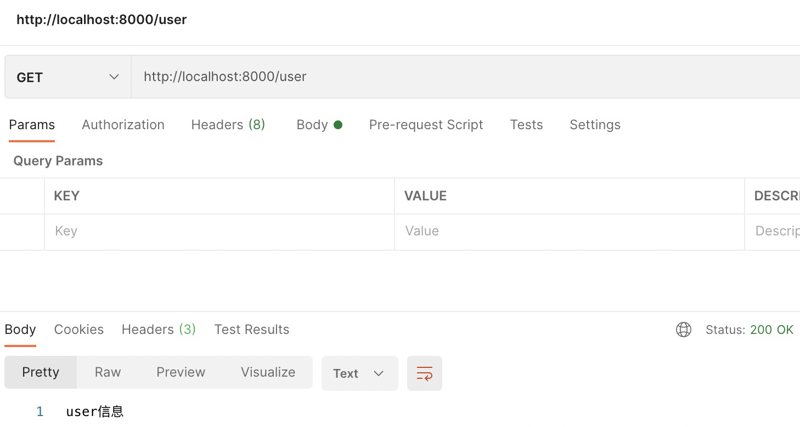
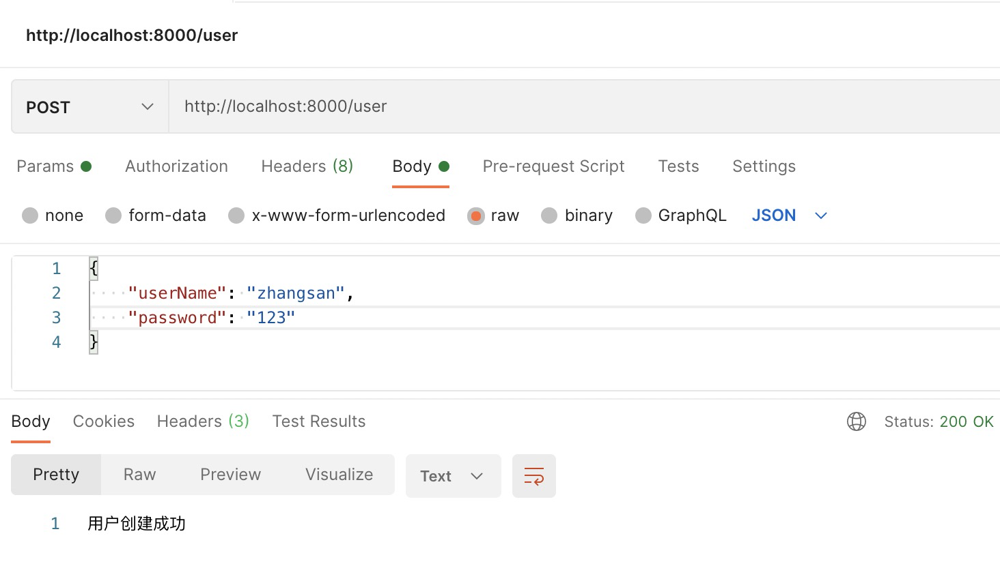

# http模块

## Web服务器

**什么是Web服务器?**

当应用程序(客户端)需要某一个资源时，可以向一个台服务器，通过Http请求获取到这个资源;提供资源
的这个服务器，就是一个Web服务器;

目前有很多开源的Web服务器:Nginx、Apache(静态)、Apache Tomcat(静态、动态)、Node.js

## 一个最简单的Web服务器

```javascript
const http = require('http');

const server = http.createServer((req, res) => {
    res.end("Hello World!")
})

server.listen(8000, () => {
    console.log("服务器启动")
})
```

上面我们已经看到，创建Server时会 传入一个回调函数，这个回调函数在 被调用时会传入两个参数:

* req: **request**请求对象，包含请求相 关的信息;
* res: **response**响应对象，包含我们 要发送给客户端的信息;

## 监听主机和端口号

```javascript
server.listen(8000, "0.0.0.0", () => {
    console.log("服务器启动")
})
```

Server通过listen方法来开启服务器，并且在某一个主机和端口上监听网络请求。也就是当我们通过 ip:port的方式发送到我们监听的Web服务器上时;我们就可以对其进行相关的处理。

`listen`函数有三个参数:

* 端口port: 可以不传, 系统会默认分配端, 后续项目中我们会写入到环境变量中;

* 主机host: 通常可以传入localhost、ip地址127.0.0.1、或者ip地址0.0.0.0，默认是0.0.0.0;

    * localhost:本质上是一个域名，通常情况下会被解析成127.0.0.1;
    * 127.0.0.1:回环地址(Loop Back Address)，表达的意思其实是我们主机自己发出去的包，直接被自己接收;

        * 正常的数据库包经常 应用层 - 传输层 - 网络层 - 数据链路层 - 物理层 ;
        * 而回环地址，是在网络层直接就被获取到了，是不会经常数据链路层和物理层的; 
        * 比如我们监听 127.0.0.1时，在同一个网段下的主机中，通过ip地址是不能访问的;

    * 0.0.0.0:

        * 监听IPV4上所有的地址，再根据端口找到不同的应用程序;
        * 比如我们监听 0.0.0.0时，在同一个网段下的主机中，通过ip地址是可以访问的;

* 回调函数:服务器启动成功时的回调函数;

## request对象

在向服务器发送请求时，我们会携带很多信息，比如:

* 本次请求的URL，服务器需要根据不同的URL进行不同的处理;
* 本次请求的请求方式，比如GET、POST请求传入的参数和处理的方式是不同的;
* 本次请求的headers中也会携带一些信息，比如客户端信息、接受数据的格式、支持的编码格式等; 

这些信息，Node会帮助我们封装到一个request的对象中，我们可以直接来处理这个request对象:

```javascript
const server = http.createServer((req, res) => {

    console.log(req.url)
    console.log(req.method)
    console.log(req.headers)

    res.end("Hello World!")
})
```

### URL

#### URL的处理

客户端在发送请求时，会请求不同的数据，那么会传入不同的请求地址。服务器端需要根据不同的请求地址，作出不同的响应。比如： 

```
http://localhost:8000/login
http://localhost:8000/products
```

#### URL的解析

那么如果用户发送的地址中还携带一些额外的参数呢?比如`http://localhost:8000/login?name=zhangsan&password=123`。这个时候，url的值是`/login?name=zhangsan&password=123`。

```javascript
const http = require('http');
const url = require('url');

const server = http.createServer((req, res) => {
    const _url = new url.URL("http://localhost" + req.url)
    console.log(_url)
    if (_url.pathname === '/login') {
        res.end(`login name=${_url.searchParams.get('name')} password=${_url.searchParams.get('password')}`)
    } else {
        res.end("error message")
    }
})

server.listen(8000, "0.0.0.0", () => {
    console.log("服务器启动")
})
```

URL对象：

```
URL {
  href: 'http://localhost/login?name=zhangsan&password=123',
  origin: 'http://localhost',
  protocol: 'http:',
  username: '',
  password: '',
  host: 'localhost',
  hostname: 'localhost',
  port: '',
  pathname: '/login',
  search: '?name=zhangsan&password=123',
  searchParams: URLSearchParams { 'name' => 'zhangsan', 'password' => '123' },
  hash: ''
}
```
 
### method的处理

在Restful规范(设计风格)中，我们对于数据的增删改查应该通过不同的请求方式，我们可以通过判断不同的请求方式进行不同的处理: 

* GET:查询数据;
* POST:新建数据;
* PATCH:更新数据;
* DELETE:删除数据;

```javascript
const http = require('http');
const url = require('url');

const server = http.createServer((req, res) => {
    // 设置编码格式
    req.setEncoding('utf-8')

    if (req.url === '/user') {
        if (req.method === "POST") {
            let userData = ""
            // 接受body数据
            req.on('data', (data) => {
                userData += data
            })
            // 结束回调
            req.on("end", err => {
                console.log("传输完成!")
                const { userName, password } = JSON.parse(userData);
                console.log(userName, password)
                res.end("用户创建成功")
            })
        } else if (req.method === "GET") {
            res.end("user信息")
        } else {
            res.end("error message")
        }
    } else {
        res.end("error message")
    }
})

server.listen(8000, "0.0.0.0", () => {
    console.log("服务器启动")
})
```

测试：



